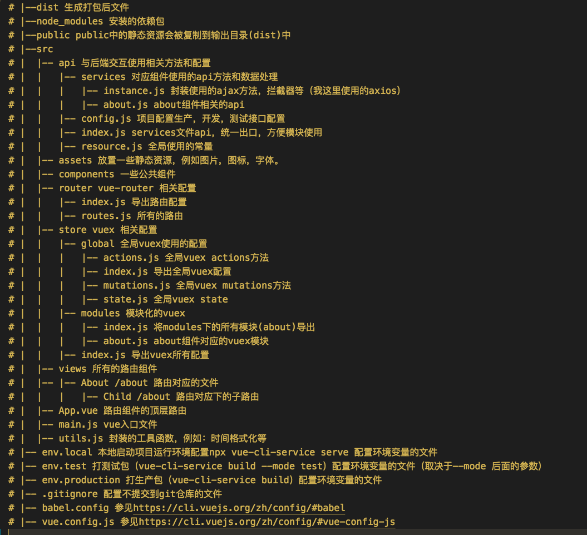

# Vue-Style-Guide

## 项目结构介绍



## Vue 属性书写顺序

```javascript
export default {
  mixins,
  data,
  props,
  store,
  computed,
  route,
  created,
  ready, // => 生命周期顺序不赘述
  event,
  watch,
  components,
  methods,
};
```

## 组件

### 命名

- 组件命名使用大驼峰

```html
<template>
  <!-- 在单文件组件和字符串模板中 -->
  <MyComponents />

  <!-- 在 DOM 模板中 -->
  <my-components></my-components>
</template>
<script>
  import MyComponents from "./MyComponents.vue";

  export default {
    components: {
      MyComponents,
    },
  };
</script>
```

- JS 文件命名

```
名使用分隔符线  resize-event.js
```

- CSS 样式命名

```html
<!-- bad -->
<div class="box">
  <div class="box-content"></div>
</div>

<!-- good -->
<div class="box">
  <div class="box_content"></div>
</div>
```

### Vue 组件的书写顺序

建议：template script style 的顺序书写

```vue
<template></template>
<script></script>
<style></style>
```

### 组件引用

```javascript
import myComponentsA from "./myComponentsA.vue";
import myComponentsB from "./myComponentsB.vue";
import myComponentsC from "./myComponentsC.vue";
import myComponentsD from "./myComponentsD.vue";
export default {
  components: {
    myComponentsA,
    myComponentsB,
    myComponentsC,
    myComponentsD,
  },
};
```

## 事件

```html
<!-- bad -->
<a v-on:click="pass()">pass</a>

<!-- good -->
<a @click="pass">pass</a>
```
